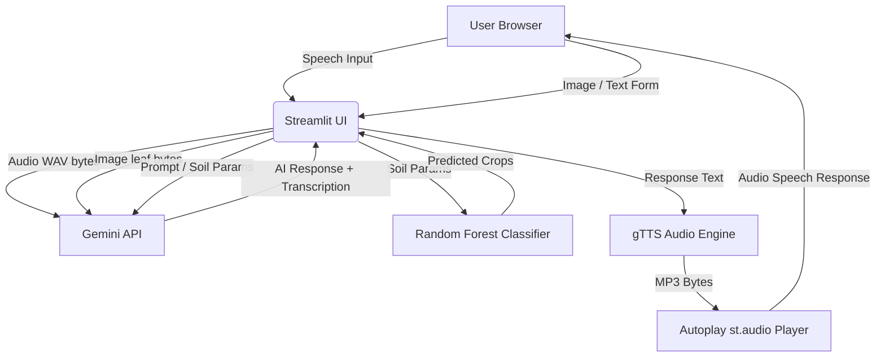

# System Architecture

This document describes the design layout and components of the **Voice-Based Natural Farming Consultant** application.

---

## 1. Architecture Overview

---

## 2. Component Details

### A. Streamlit Web UI (`organic_consultant.py`)
* Serves as the interactive dashboard frontend.
* Embedded with a premium custom stylesheet (fonts loaded from Google Fonts, radial forest-green backgrounds, and glassmorphic card elements).
* Session states (`st.session_state`) track predictions and API responses to prevent Streamlit from wiping the outputs on re-render triggers.
* **Dynamic Widget Resetting**: Employs dynamic key counters (`voice_key` and `academy_key`) bound to user input widgets. Incrementing these counters dynamically recreates the widgets, resetting recorders and clearing query states instantly.

### B. Machine Learning Inference
* Evaluates soil N-P-K, temperature, humidity, pH, and rainfall.
* Loads a local Scikit-Learn Random Forest Classifier (`crop_recommendation_model.pkl`) using relative imports to predict the top 3 recommended crop indices.
* Maps numerical crop categories back to strings and displays matching organic seed profiles.

### C. Voice Engine Pipeline
* **Input (STT)**: User records audio on `st.audio_input`. The browser captures microphone input natively and produces a standard `audio/wav` output.
* **Transcription & Processing**: The app extracts the audio bytes, base64 encodes them, and sends them directly inside the `inlineData` block to Gemini (`gemini-flash-lite-latest`).
* **Output (TTS)**: The returned organic response text is synthesized using `gTTS` and loaded as a `BytesIO` buffer, which is auto-played in the user's browser using `st.audio(..., autoplay=True)`.

### D. Offline Fallback Layer
* If the Gemini API key is missing or offline:
  * **Image Diagnostics**: Prompts the user to add an API key.
  * **Voice Assistant**: Replaces the transcription call with a text-based input box, using a keyword matching engine (searching for terms like `jeevamrutha`, `beejamrutha`, or pest names) to return traditional recipes from local Python dictionaries.
  * **Weather**: Uses a mock hash-generator that computes local weather dynamically based on the ASCII sum of the entered city name, ensuring functional demonstrations even without active internet access.
